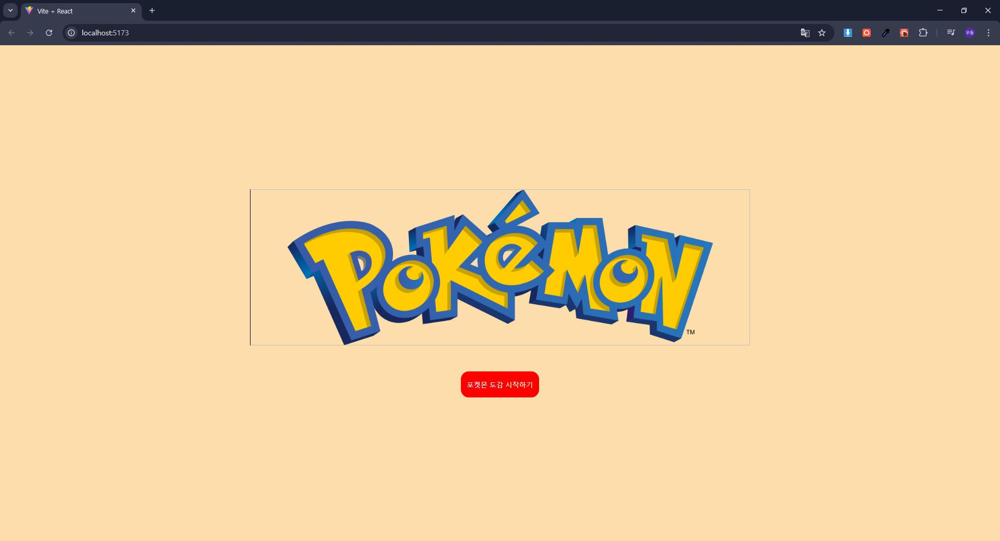
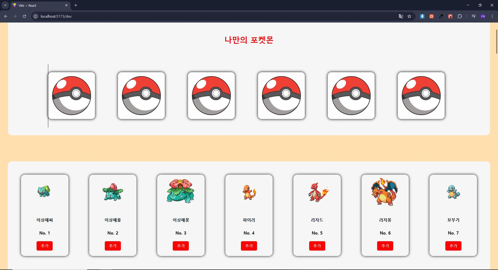
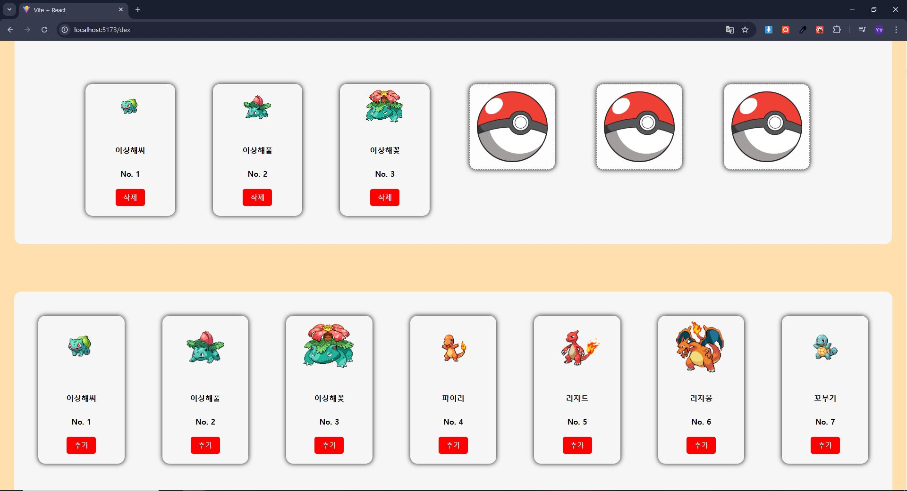
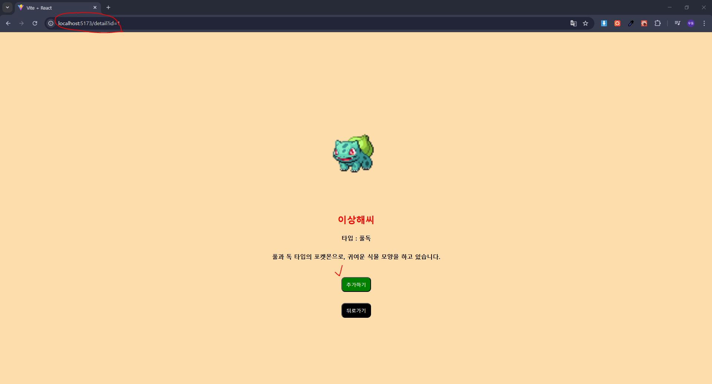
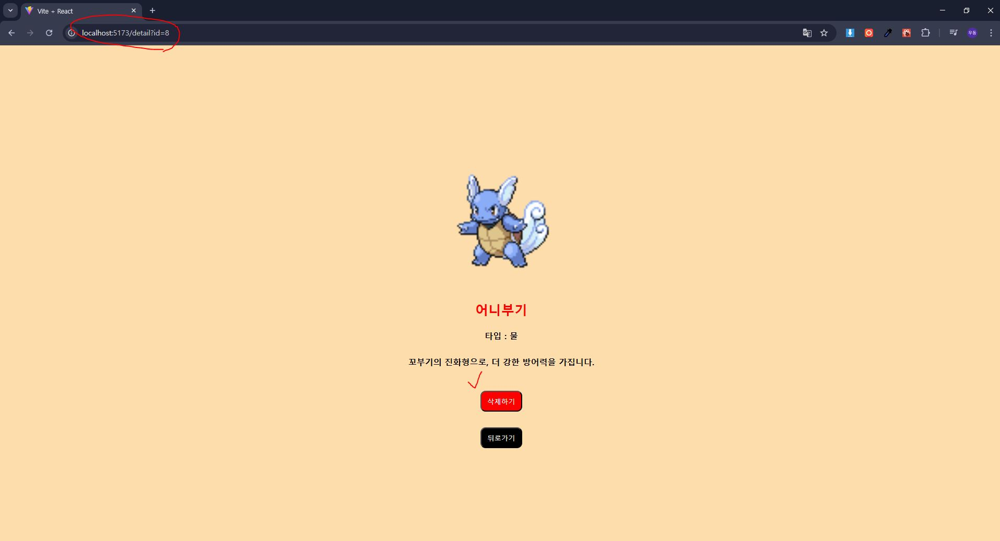

<h2>나의 포켓몬 도감</h2>
나만의 포켓몬을 잡는 프로그램 입니다.


---


## 💡프로젝트 설명
여러 포켓몬이 있는 도감안에서 원하는 포켓몬을 추가 및 삭제 할 수 있고 상세페이지에서 포켓몬들의 정보들을 열람할 수 있습니다.


---

## 스크린샷
 <br/>
**Home** &emsp;&emsp;&emsp;&emsp;&emsp;&emsp;&emsp;&emsp;&emsp;&emsp;&emsp;&emsp;&emsp;&emsp;&emsp;&emsp;&nbsp; 
**Dex**
<br/><br/> 
 <br/>
**Add, Remove**
&emsp;&emsp;&emsp;&emsp;&emsp;&emsp;&emsp;&emsp;&emsp;&emsp;&emsp;&emsp;&nbsp;&nbsp;&nbsp; 
**Alert**
<br/><br/> 
 <br/> 
**Detail-Add**
&emsp;&emsp;&emsp;&emsp;&emsp;&emsp;&emsp;&emsp;&emsp;&emsp;&emsp;&emsp;&emsp;&nbsp;&nbsp;&nbsp; 
**Detail-Remove**


---


## 🌟프로젝트 구조 및 기능

```plaintext
my-pocketmon-dex/
├── LICENSE
├── README.md
├── public/
├── src/
│   ├── assets/
│   │    ├── imgFile/
│   │    │     ├── poketball.png 
│   │    └── pokemon/
│   │    │     ├── MOCK_DATA.js
│   ├── components/
│   │    ├── Dashboard.jsx 
│   │    ├── PokemonCard.jsx 
│   │    ├── PokemonList.jsx 
│   │    └── PokemonDetail.jsx 
│   ├── context/
│   │    └── PokemonProvider.jsx 
│   ├── pages/
│   │    ├── Home.jsx
│   │    └── Dex.jsx
│   ├── shared/
│   │    └── Router.jsx
│   ├── styles/
│   │    ├── dashboard.js
│   │    ├── detail.js 
│   │    ├── list.js 
│   │    └── main.js
│   ├── App.css
│   ├── App.jsx
│   ├── index.css
│   ├── main.jsx

```


---
## ⚙️설치 방법

#### ▶️프로젝트 클론 : https://github.com/noodlewd/my-pocketmon-dex.git
                                                                                    
#### 🔽의존성 설치 : yarn install
                                          
#### ◀️개발 서버 시작 : yarn dev

### ✏️사용 방법 : 브라우저에서 로컬환경으로 실행하여 프로그램을 이용하실 수 있습니다.


---


## 🛠️기술 스택
- **프론트엔드** : React, Vite, React Router, JS, Styled Components
- **개발 도구** : Visual Studio Code, Git
- **배포** : Vercel


---


## 👨🏻‍🏫기능설명

### 1️⃣. 포켓몬 나만의 몬스터볼 추가, 삭제 기능
 - 사용자가 원하는 포켓몬을 도감에서 추가 할 수있고 원치않으면 삭제 할 수 있습니다.

### 2️⃣. 상세 페이지
 - 포켓몬의 이미지를 클릭 시 상세페이지로 이동하며 포켓몬에 대한 설명 및 추가, 삭제, 뒤로가기 기능이 구현되어 있습니다.

### 3️⃣. 알람
 - 사용자는 자신의 포켓몬을 도감으로부터 최대 6개까지 담을 수 있으며, 그 수를 초과하거나 중복된 포켓몬을 담을 시 알람이 발생합니다.


---

## 👨‍💻개발 인원
- 김동우(프론트엔드)


---


## ✅추가 계획
- 포켓몬 검색 기능
- 상세페이지에서 좌 우로 이동 기능
